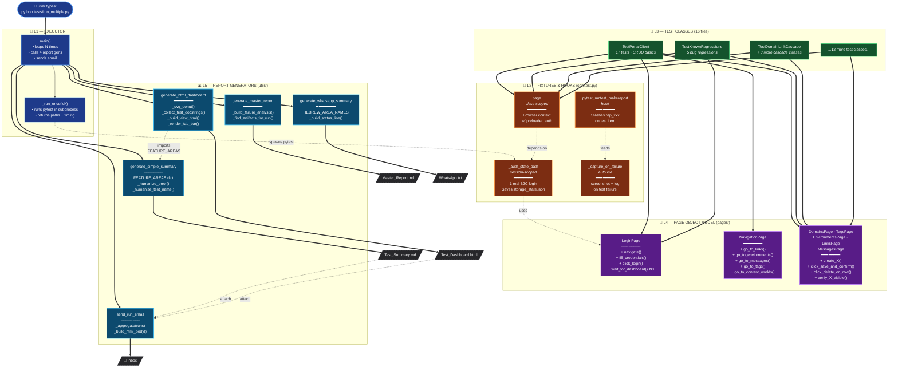
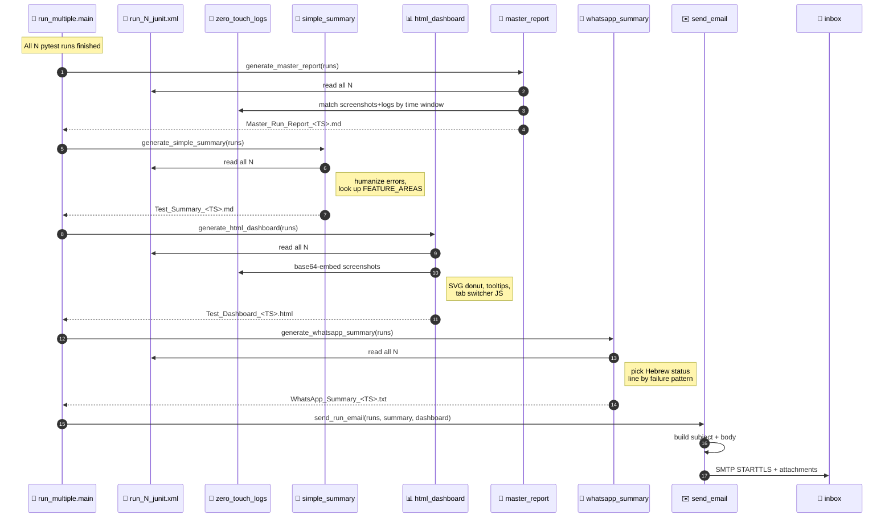

# 📐 Visual Diagrams — Better Class & Function Maps

Two complementary views — same data, different angles:

1. **Layered Flowchart** — *structure*: what calls what, grouped by purpose, color-coded
2. **Sequence Diagrams** — *timeline*: what happens first, what next, who talks to whom

Paste either Mermaid block into draw.io via `Arrange → Insert → Advanced → Mermaid`.

---

## 1️⃣ Layered Flowchart (recommended for big-picture)

A single page showing all 5 layers with **methods visible on the key classes**,
**labeled arrows**, and **color-coding by layer**. Far easier on the eyes than
the dense class diagram because related things are grouped into colored
boxes and only the most important methods are shown.

### Reading guide

| Arrow style | Meaning |
|---|---|
| `==>` (thick solid) | "Uses" / "Calls" — strong dependency |
| `-.->` (dotted) | "Configures" / "Imports" / "Triggers" — looser link |
| `[/file/]` (parallelogram) | A file output, not a class |
| `()` round | The entry-point trigger (you) |
| Subgraph color | The layer: blue/orange/green/purple/cyan |

---

## 2️⃣ Sequence Diagram — "What happens during one test"

**Better than a class diagram if you want to understand the runtime flow.**
Reads top-to-bottom like a story. Each vertical line is one object; arrows
between them are messages over time.

```mermaid
sequenceDiagram
    autonumber
    actor User as 🧑 You
    participant Exec as 🚀 run_multiple
    participant PT as pytest
    participant CF as 🔧 conftest
    participant LP as 🔑 LoginPage
    participant POM as 📄 PageObjects
    participant T as 🧪 TestClass

    User->>Exec: python run_multiple.py
    Exec->>PT: subprocess pytest

    rect rgb(40, 60, 90)
        Note over PT,CF: ONCE PER SESSION
        PT->>CF: _auth_state_path()
        CF->>LP: navigate + fill + click + wait
        LP-->>CF: ✓ logged in
        CF-->>PT: storage_state.json
    end

    loop For each TestClass
        rect rgb(60, 40, 30)
            Note over PT,CF: PER CLASS
            PT->>CF: page fixture
            CF-->>PT: browser context w/ auth
        end

        loop For each test method
            PT->>T: test_XX()
            T->>POM: action e.g. create_link
            POM-->>T: ✓ result
            T->>PT: assert
            alt 😱 Test fails
                PT->>CF: _capture_on_failure
                CF->>CF: screenshot + dump logs
            end
        end
    end

    rect rgb(20, 60, 50)
        Note over Exec: AFTER ALL RUNS
        Exec->>Exec: generate 4 reports
        Exec->>Exec: send email
    end
```

---

## 3️⃣ Sequence Diagram — "How a report gets built"

Shows the post-run pipeline: from raw JUnit XMLs to the email landing in
your inbox.

---

## 4️⃣ How to paste into draw.io

1. Open https://app.diagrams.net (or the desktop app)
2. Create a blank diagram
3. Go to: `Arrange` → `Insert` → `Advanced` → `Mermaid`
4. Paste any of the three Mermaid blocks above
5. Click **Insert** — draw.io renders it as editable shapes
6. Drag/resize/recolor as needed
7. Export: `File` → `Export as` → PNG / SVG / PDF

## 5️⃣ Tips for making diagrams more readable

| Problem | Fix |
|---|---|
| Too many lines crossing | Group related classes into subgraphs (we do this) |
| Hard to tell "uses" from "imports" | Use different arrow styles (we use `==>` vs `-.->`) |
| Can't see the flow | Set `direction TB` or `LR` to force top-to-bottom or left-right |
| Boxes look the same | Color-code by layer with `classDef` (we do this) |
| Too many methods | Show only the 3–4 most important per class — link to `CALL_GRAPH.md` for the rest |
| Static structure unclear | Use a **sequence diagram** instead — it shows time order |

## 6️⃣ Which diagram for which purpose?

| You want to show... | Use this |
|---|---|
| **The whole codebase at a glance** | Layered Flowchart (#1) |
| **How a test runs step-by-step** | Sequence Diagram (#2) |
| **How reports get built and emailed** | Sequence Diagram (#3) |
| **Just the classes & their methods** (no runtime) | Class Diagram (the original #2 from before) |
| **One specific feature's flow** | Smaller sequence diagram zoomed on that flow |

## 7️⃣ Pro tip — keep diagrams in sync with code

The diagrams here are **derived from `CALL_GRAPH.md`** — if you change
something in the code:

1. Update `CALL_GRAPH.md` first (it's the source of truth)
2. Then update the relevant Mermaid block here
3. Re-paste into draw.io if you have a live diagram

That way the docs stay aligned with reality.
